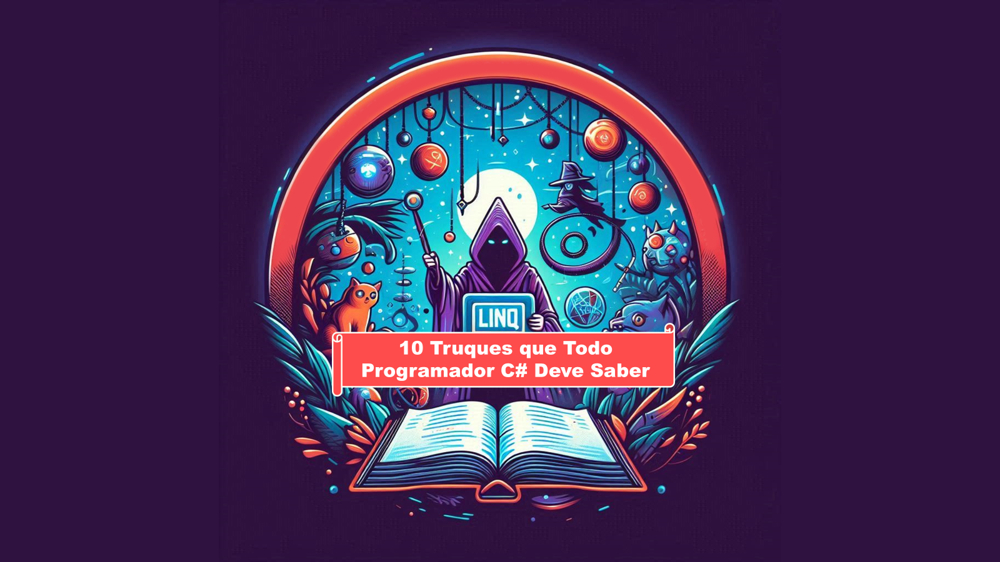

# Projeto Prompts para Criar um ARTIGO

 > ℹ️ **NOTE:** Este repositório foi elaborado durante o Bootcamp promovido pelo Santander na [DIO](https://dio.me).

O projeto surge como um desafio proposto durante o bootcamp, visando a criação de um artigo digital através da utilização das mais avançadas ferramentas de Inteligência Artificial. Abaixo, encontram-se listados os prompts que nortearão o desenvolvimento deste projeto.

<a href="https://www.dio.me/articles/10-truques-de-linq-que-todo-programador-c-deve-saber" title="View PDF now"> 📕Clique aqui para ler</a>

## 💻 Tecnologias utilizadas no projeto

- [ChatGPT](https://chat.openai.com/) 
- [Copilot](https://copilot.microsoft.com/)
- [PowerPoint](https://www.microsoft.com/en/microsoft-365/powerpoint)

## 🧙🏻‍♀️ Prompts 

ChatGPT：

|   Ação   | prompt                                                                                                                                                                                                                                                                         |
| :------: | ------------------------------------------------------------------------------------------------------------------------------------------------------------------------------------------------------------------------------------------------------------------------------ |
|  Título  | Crie 10 headlines para nomes de artigos sobre o assunto C# - LINQ    
| Conteúdo | Comporte-se como um escritor de artigos tech back-end atendendo as regras abaixo
| {REGRAS} | Titulo: "10 Truques de LINQ que Todo Programador C# Deve Saber", os truques devem ser enumerados
||No maxímo 5 linhas por bloco de explicação
||Me explique de maneira informal, como se eu fosse uma criança de 10 anos
||O que são Linq No C#: Quais são os métodos do LINQ e Cite exemplos com código de metodos LinQ
||O que são operadores de consulta e cite exemplos com codigo dos operadores de consulta
||Faça um call to action para as minhas redes sociais
||Coloque 3 hastags que façam sentido |

Copilot：

|  Ação  | prompt                                                                                 |
| :----: | -------------------------------------------------------------------------------------- |
| Título | Crie uma capa chamativa para o tema "10 Truques de LINQ que Todo Programador C# Deve Saber" |

## ✨ Features

- Conteúdo gerado via ChatGPT
- Imagens geradas via Copilot

## 📚 Materiais

- Imagens utilizadas em `assets`

## 🛠️ Instruções de execução

Empregue os prompts mencionados utilizando as ferramentas recomendadas para gerar o conteúdo base e utilize um software de edição de documentos, como o PowerPoint ou Canva, para realizar a edição do banner e estruturação do artigo. 
Escolha uma mídia social para postar seu artigo.

